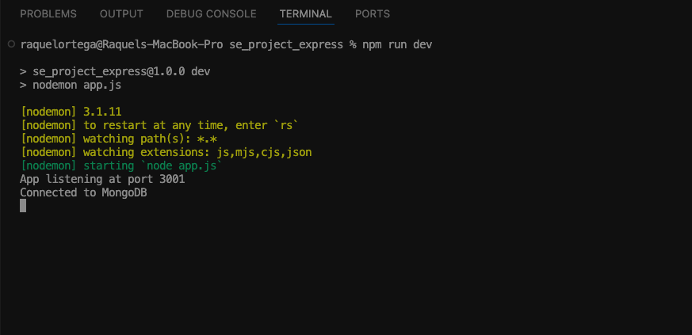

# WTWR (What to Wear?): Back End

## About the Project
This project is the back-end portion of the "What to Wear?" application. It provides a server-side API to manage a user's wardrobe items and handle "likes" for specific clothing pieces. The server suggests clothing based on weather data and allows for persistent storage of user-created items.

## Technologies and Techniques
* **Node.js** - JavaScript runtime environment.
* **Express.js** - Web framework for Node.js.
* **MongoDB** - NoSQL database for data storage.
* **Mongoose** - Object Data Modeling (ODM) library for MongoDB and Node.js.
* **REST API** - Architecture for network requests.
* **ESLint / Airbnb-base** - For code quality and style consistency.
* **MVC Pattern** - Organized into Models, Views (JSON responses), and Controllers.

## Project Features
* **User Management:** Create and retrieve user profiles.
* **Clothing Item Management:** Add, delete, and list clothing items.
* **Like System:** Users can like or unlike specific clothing items.
* **Error Handling:** Centralized error constants and formatted error messages.

## Running the Project
`npm run start` — to launch the server  
`npm run dev` — to launch the server with the hot reload feature  
`npm run lint` — to run the linter and check for style errors

## Screenshots
